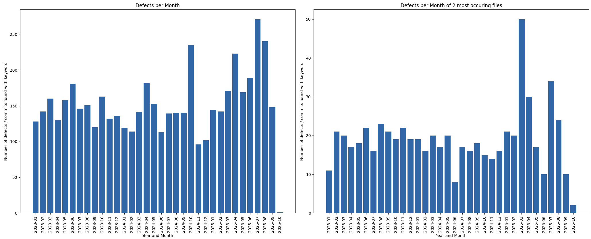
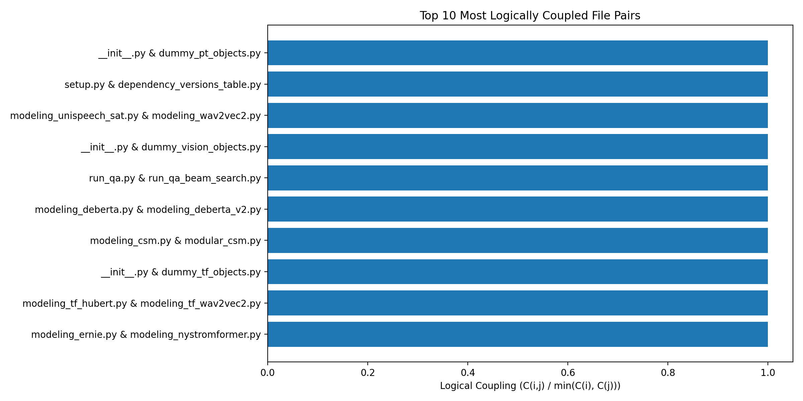

# Fundamentals of Software Systems - Software Evolution - Part 1 Assignment
Daniel Maksimovic, Cedric Egon von Rauscher, Mika Schoch

# Task 1: Defect Analysis
## Question: Calculate and plot the total number of defects per month. Why do you think the number of defects dropped sharply in October 2025?
Commit 2ccc6ca contains many commit messages in one. Multiple of these have the word fix in them. But since we only count if the keyword is in the commit and not how often it is in the commit, we will get a 1 for the month October in 2025. https://github.com/huggingface/transformers/commit/2ccc6cae21faaf11631efa5fb9054687ae5dc931

## Question 2: Calculate and plot the number of defects per month for the two files with the highest number of defects. In which month were the most defects introduced? How would you explain it? Manually examine the repository for that month (e.g., change logs, releases, commit messages) and come up with a hypothesis.
March 2025. We can see that there was a large change 'Gemma3' with many commits. This seems like a large introduction of a new model/module which can cause many issues.

## Question 3: What are the limitations of this method for finding defective hotspots?
### 1. Keyword restriction
We restrict ourselves to certain keywords. We don't know how commit messages are handled, it could be that sometimes none of the keywords provided in this code is ever used for a fix. (we make assumptions about the commit message handling)

### 2. Defective files having side effects on other files
Further we consider whole commits and then look at the files within one commit containing one of the keywords. This can lead to noisy data in the sense that we consider files to be "defective" since they were changed in one of those commits containing a certain keyword even if they did not have a defect. A scenario for this could be when a file references a defective file or need to acces some of its methods and maybe the signature of the method (params or return values) changed with the fix. 

# Task 2: Complexity Analysis of the Transformers Repository

## Overview
This part analyzes the complexity of the Hugging Face Transformers repository using the two complexity metrics:

- **Cyclomatic Complexity (CC)** - which measures the number of linearly independent paths through the Python files by measuring the control flow within the program.
- **Lines of Code (LoC)** - which measures the number of lines of executable code excluding blank lines and comments.

The goal of this task was to:

1. Calculate the LoC and CC of all .py files.
2. Identify complexity hotspots.
3. Visualize the complexity distribution across the entire project.
4. Analyze if the selected CC and LoC correlate.
5. Relate complexity with possibility for defects using data from task 1.

---

## 1. Methodology

### 1.1 Repository and File Selection
- In this part only .py files from the Transformers repository where analyzed.
- The template directories in the Transformers repository such as 'templates/adding_a_new_example_script/{{cookiecutter.directory_name}}' were excluded from the cyclomatic complexity analysis because they contain invalid Python placeholders.

### 1.2 Lines of Code (LoC)
For computing the complexity metric LoC we used the Python library cloc, also shown in the examples from the lecture's book, which outputs blank, empty, and code lines. The code lines themselves only count executable code lines and do not count blank lines or comments.

### 1.3 Cyclomatic Complexity (CC)
We used the Python library radon to compute the CC as follows:

from radon.complexity import cc_visit
blocks = cc_visit(code)
total_cc = sum(b.complexity for b in blocks)

Therefore, for each file we summed up the complexity of all functions/classes into a single total CC per file.

### 1.4 Hotspot Definition
The complexity hotspots were defined as files, which are in the top 10% for CC or LoC. The thresholds, which we used for CC and LoC were the following:
- 90th percentile CC: 195.7
- 90th percentile LoC: 864.7

### 1.5 Tools Used
The tools used for the completing the task 2 were:
- Python 3.12 (isolated virtual environment)
- cloc
- radon
- pandas
- mathplotlib
- pathlib / subprocess for automation
All packages needed are exported to requirements.txt.

## 2. Results

### 2.1 Hotspot Visualization
The scatter plot below visualizes the complexity metrics LoC and CC for all the .py files of the Transformer repository.
The complexity hotspots are displayed in red and are more prominent in the upper-right region.

### 2.2 Example Hotspot Files
As displayed above the scatter plot, some of the most complex .py files include:
- src/transformers/modeling_common.py
- src/transformers/modeling_utils.py
- src/transformers/trainer.py
- src/transformers/models/seamless_m4t_v2/modeling_seamless_m4t_v2.py
- src/transformers/models/seamless_m4t/modeling_seamless_m4t.py
These .py files have both a high number of LoC and a high CC.

## 3. Correlation Between LoC and Cyclomatic Complexity
To proof the statement "Files with more lines of code tend to have higher cyclomatic complexity" we computed the Pearson correlation between LoC and CC. The Pearson correlation resulted to 0.9234, which indicates a very strong correlation. Therefore, this statement is supported by the Person correlation and the scatter plot additionally confirms this visually, since the cyclomatic complexity tends to grow approximately linearly with the number of lines of code.

## 4. Relation Between Complexity and Defect-Proneness
To proof the claim that " Files with higher complexity tend to be more defective" we analyzed the Transformer repository as follows.

1. We merged the complexity data with the defect data.

df_merged = df.merge(defects, on="file", how="left")
df_merged["defects"] = df_merged["defects"].fillna(0)

2. We calculated the correlations between CC and the defects and between LoC and the defects.

3. We compared the top 10% CC group with the lower CC groups to see if files with higher complexity exhibit more defects.

4. Using a scatter plot we visualize the relation between CC and the defects. Additionally, we visualize using a boxplot the top 10% CC and the bottom 90%.

## 5. Design Decisions & Limitations

### 5.1 Complexity Metrics CC and LoC
We chose the complexity metrics CC and LoC for this task, because they capture two complementary dimensions of software complexity.

1. Lines of Code: Measuring the size
One the one side LoC measures the size of a file in terms of lines of executable code. The larger the files gets, usually the more complex it gets to maintain the file. Additionally, when a developer has more code to analyze and understand, a higher cognitive load is needed for the developer to understand all the code and LoC also turned out to be one of the strongest individual predictors of quality issues in the code. Therefore, since LoC is a simple metric, which is easy to understand, it provides a first baseline to measure the size of the files.

2. Cyclomatic Complexity: Measuring the logical complexity
On the other side CC measures the number of independent linear paths in the code and captures aspects, which LoC cannot check:
- Branching
- Number of decision points
- While and until loops
CC therefore is logic related and provides a basis to understand how hard a file is to reason about, test, develop, and maintain.

### 5.2 Scatter Plot
We decided to use a scatter plot because it can display two dimensions at the same time. Furthermore, hotspots appear naturally in the upper-right corner and they are easy to detect and understand for users, which are not technical experts.

### 5.3 Limitations
For computing the LoC we used the Python library cloc, which excludes comments and blank lines and there might be different definitions of LoC. The hotspot selection using the 90th percentile was arbitrarly chosen, but is also commonly used in practice.

## 6. Files Produced
When executing the entire analysis file fss_se_assignment.py the following files will be automatically created:
- cloc_output.csv 
The raw cloc output after cloc has computed the LoC of all files, will be stored in the file cloc_output.csv.
- task2_loc_cc.csv
The combined LoC and CC metrics of all files are stored in task2_loc_cc.csv.
- task2_hotspots.csv
All the hotspot files of the repository are stored in task2_hotspots.csv.
- complexity_hotspots.png
The created scatter plot is stored in the file complexity_hotspots.png.
- task2_correlations.csv
The correlation value between LoC and CC is stored in task2_correlations.csv.

## 7. Conclusion
The Transformer repository contains several large and complex Python files, which can be found especially under src/transformers/models and testing utilities. CC and LoC show a very strong correlation (0.92), which indicates that files with more lines of code tend to have higher cyclomatic complexity.

# Task 3: Coupling Analysis
## 10 Most Coupled File Pairs

The files setup.py and dependency_versions_table.py have a high logical coupling, because setup.py defines the requirements for packages and dependency_versions_table.py contains the supported versions of the packages. Whenever a dependency is updated, the versions are changed in both files.

## 10 Most Coupled File Pairs (with test files)

The files backbone_utils.py and test_backbone_utils.py are highly coupled. When a test file and a non-test file change together in the same commits very often (high logical coupling), it means that the test is tightly focused on that specific piece of production code. Whenever developers modify the code, they also have to adjust the test for it to pass, which means the test is sensitive to changes of the specific code.
Therefore, the high coupling does not indicate that the code should be refactored. It rather shows how closely the tests track changes in the code.

## Methods For Selecting the Most "Related" Test File
1.	**Version-control based logical coupling**: 
We can use the Git history to find the test file that most often changes together with the target input .py file. It finds the test file which is the most associated with a given source file based on the commits.
However, finding these files e.g. computing coupling can take several minutes, depending on how many commits are being searched for and how big the repository is.

2.	**Matching structural and naming conventions**:
Usually, the test files and folder structure in the /test folder mirrors the one in the /src folder. With that, the associated file can easily be located by getting the path of the target input .py file. This solution is fast and doesn’t require Git history.
However, it may not find additional integration tests that are stored elsewhere, or test files that cover multiple modules. It only works in a repository with exact same /src and /test structure.

4.	**Coverage-based mapping**:
We could use test coverage to see which test files execute the lines in the target .py file. The test file with tests that hit and cover the most parts of the target .py file is the most related.
However, if coverage is too low, this metric may not be useful. Also, the quality of the tests play a role. Furthermore, the entire test suite has to be run, which could take long. This doesn’t require the test files to have a correct naming convention.

6.	**Test file import analysis**:
Analyse the imports of all test files and take the test files that import the target .py file. This doesn’t require Git history or tests to run and also doesn’t need correct naming conventions and file/folder structures.

## Implementation of Structural Naming Method and Import-Analysis Method
**Structural Naming Method**

First, it maps the generation subfolder under src/transformers to tests/generation, and then it creates the test file with the naming convention of adding “test_” to the target .py file, e.g. for utils.py it creates test_utils.py.
However, this is wrong, as the structure in /test is not identical to the one in /src. The corresponding test file is at tests\generation\test_utils.py.

-> task3_4_1() in fss_se_assignment.py

**Import-Analysis Method**

It analysis the import statements of all the files in the fest folders. It outputs the filepath of the test file that imported the input .py file.
For src/transformers/generation/utils.py, it outputs the path tests\generation\test_utils.py which is correct (the file already exists there and imports the utils.py target file.

-> task3_4_2() in fss_se_assignment.py
